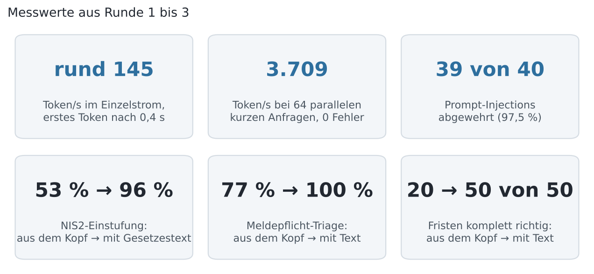
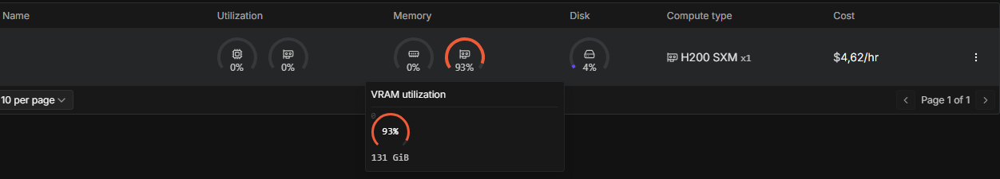
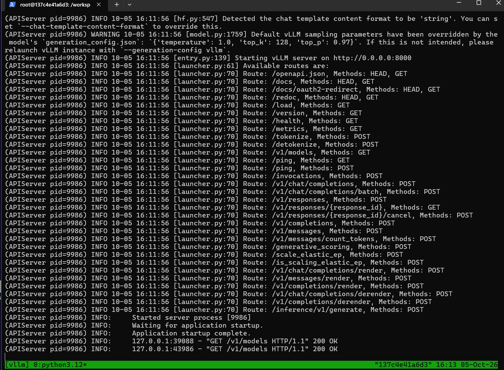
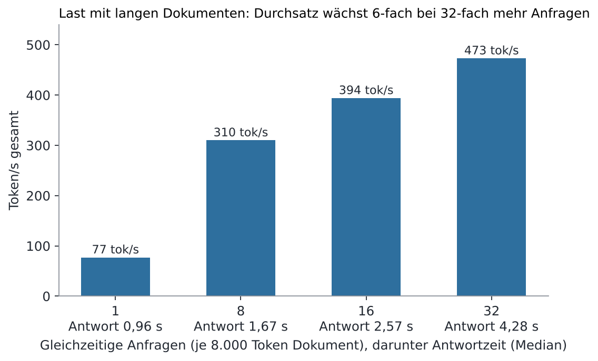
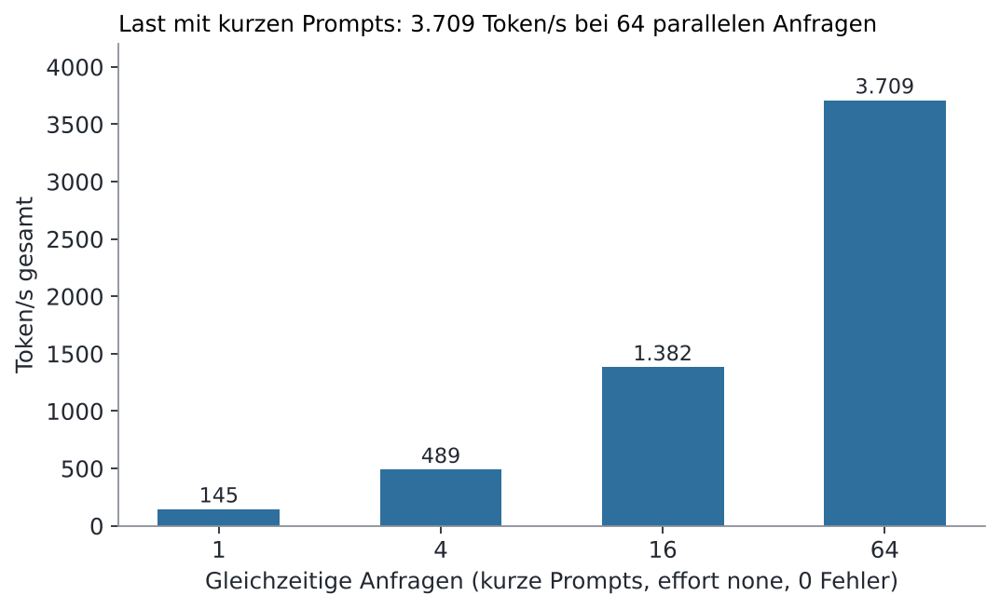
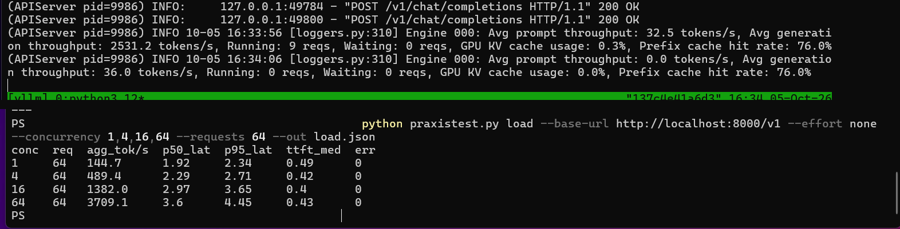
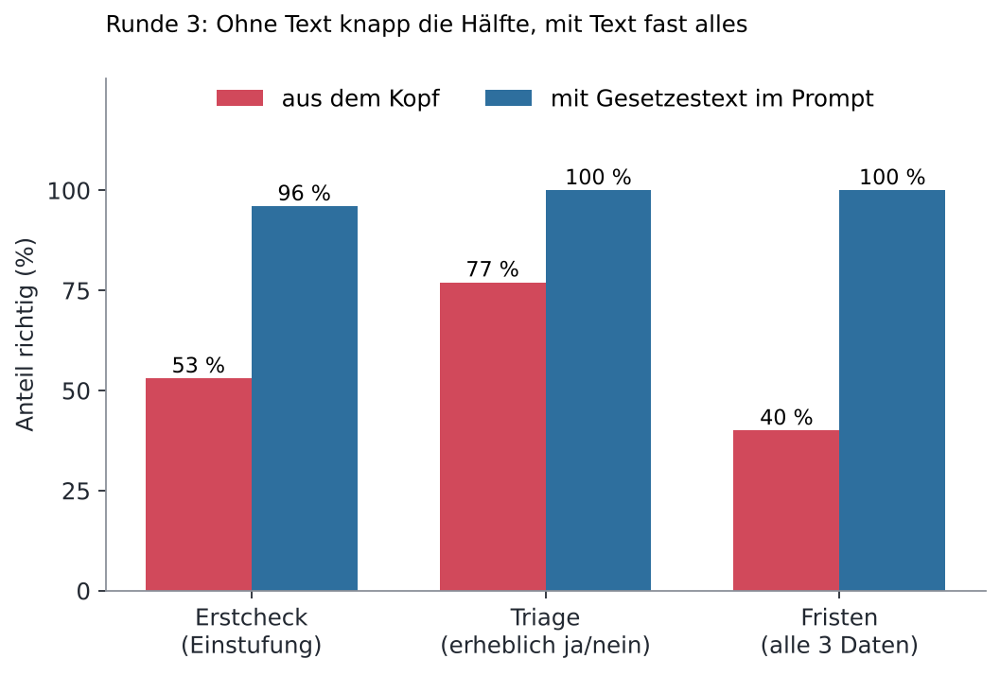
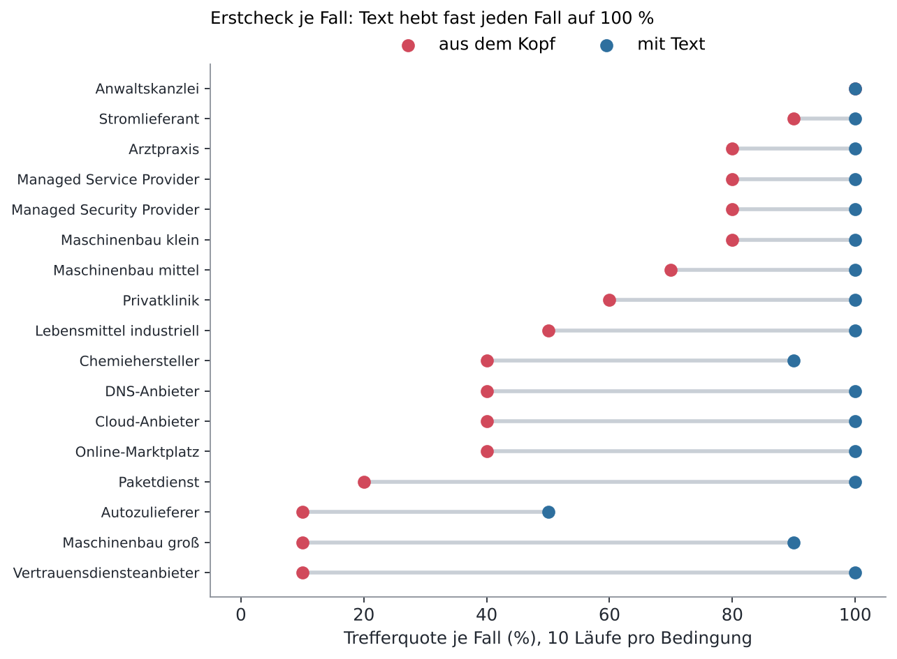
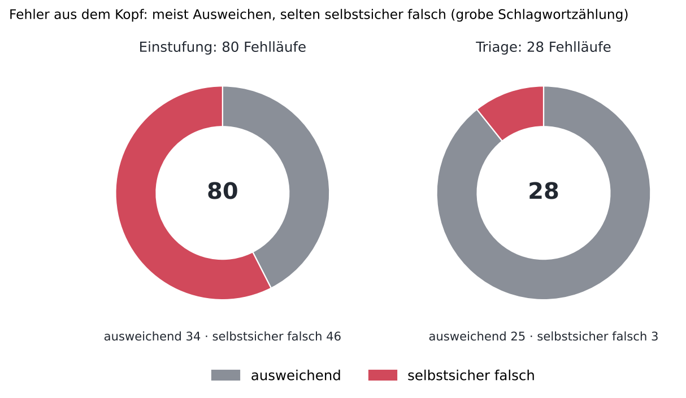

# Kolibri-1 im Praxistest: NIS2, Kanzlei, IT-Dienstleister

**Stefan Beierle**  
Independent Researcher, Makkah, Saudi Arabia  
ORCID: [0009-0005-8512-3839](https://orcid.org/0009-0005-8512-3839)  
Correspondence: [stefan.beierle@pm.me](mailto:stefan.beierle@pm.me)  
Date: October 2026  
Preprint / Architecture Report

DOI: [10.5281/zenodo.23171160](https://doi.org/10.5281/zenodo.23171160) · Lizenz: CC BY 4.0 · Status: Preprint, nicht begutachtet

> **Unabhängigkeit und KI-Hinweis.** Dieser Test ist unabhängig: keine Verbindung zu Aleph Alpha, kein Auftrag, keine Vergütung. Bericht, Testcode und Antwortschlüssel wurden gemeinsam mit Claude (Anthropic) erstellt; die Läufe hat der Autor selbst ausgeführt. Die Antwortschlüssel sind nicht juristisch geprüft. Kein Rechtsrat.

## Abstract

Ich teste das offene MoE-Sprachmodell Aleph Alpha Kolibri-1 (78,1 Mrd. Parameter, 3,46 Mrd. aktiv, FP8) auf einer einzelnen H200 unter vLLM 0.29.0 für NIS2/BSIG, Kanzlei mit Berufsgeheimnis und IT-Dienstleister. Grundlage sind 1.851 gewertete Läufe in drei Runden mit regelbasierter Auswertung. Das Modell ist schnell (rund 145 Token/s im Einzelstrom, erstes Token nach 0,4 s, 3.709 Token/s bei 64 parallelen kurzen Anfragen ohne Fehler) und widersteht Prompt-Injection in 39 von 40 Läufen. Bei deutschem Fachrecht ist es aus dem Kopf unzuverlässig: Die NIS2-Einstufung stimmt in 53 % der Läufe, alle drei Meldefristen in 20 von 50 Antworten, die einschlägige Vorschrift § 32 BSIG wurde nur einmal genannt. Die Fehler sind überwiegend Ausweichen, teils selbstsicheres Erfinden. Ohne Datum und Wissensstichtag im System-Prompt hält das Modell den eigenen Wissensstand für die Gegenwart; mit Datum, aber ohne Stichtag erfindet es Ereignisse. Mit dem Gesetzestext im Prompt liegt die Einstufung bei 96 %, die Triage bei 120 von 120 und die Fristen bei 50 von 50 Läufen. Praxisurteil: lokal betreibbarer, schneller Assistent für Entwürfe und IT-Aufgaben, für Rechtsfragen nur mit Gesetzestext im Prompt und menschlicher Prüfung. Stichprobe, kein Benchmark, ein Modell, keine Vergleichsmodelle.

**Abstract (English).** An independent practical test of the open-weight MoE model Aleph Alpha Kolibri-1 (78.1B total, 3.46B active, FP8) on a single H200 with vLLM 0.29.0, covering German NIS2/BSIG compliance, law-firm confidentiality and IT-service tasks (1,851 scored runs, rule-based scoring). The model is fast (about 145 tokens/s single stream, 3,709 tokens/s at 64 concurrent short requests, no errors) and resisted prompt injection in 39 of 40 runs. Without the statute text in the prompt it is unreliable on German regulatory law (NIS2 classification 53 % correct, all three reporting deadlines correct in 20 of 50 answers); with the text in the prompt it reaches 96 %, 120/120 and 50/50. Answer keys were produced with an AI assistant and are not legally reviewed. Small samples, one model, not a benchmark.

**Schlüsselwörter:** Kolibri-1, NIS2, BSIG, Open-Weight-Modell, LLM-Evaluation, Halluzination, Prompt-Injection, vLLM

## Kurzfazit

Kolibri-1 ist auf einer einzelnen H200 schnell (rund 145 Token/s im Einzelstrom, erstes Token nach etwa 0,4 s), bei deutschem Fachwissen zu NIS2 und Berufsrecht aber unzuverlässig und ohne Absicherung zum Erfinden neigend. Als Chat-Assistent für Alltagstexte, IT-Dienstleister-Fragen und Souveränitätsthemen taugt es im Test gut; für Rechtsauskünfte nur mit Gesetzestext im Prompt (dann bei Normen, Fristen und Einstufung in 96 bis 100 % der Läufe richtig, aus dem Kopf etwa die Hälfte) und menschlicher Prüfung.

*Abbildung 1: Messwerte aus Runde 1 bis 3, Details in den Befunden 1, 5 und 6.*

- **Tempo:** Median 142–162 Token/s je Anfrage, TTFT-Median 0,41–0,43 s, 0 Fehler in allen Läufen (mit ungetunter Standard-MoE-Konfiguration, die Zahlen sind eher konservativ).

- **Fachwissen (Regex-Score, 2 Wiederholungen):** NIS2 0,54 (none) bzw. 0,56 (low); Kanzlei 0,57 bzw. 0,51; IT-Dienstleister 0,94 bzw. 1,0; Security 0,92 bzw. 1,0; Souveränität 1,0 in beiden Modi.

- **Instabil:** Dieselbe Frage liefert bei T=1.0 mal die richtige, mal eine falsche Norm oder Frist. Die Maschinenbau-Frage wurde in einem Probelauf mit „nein, nicht betroffen“ beantwortet; nach meinem Antwortschlüssel wäre ein Maschinenbauer eine wichtige Einrichtung (bitte gegenprüfen).

- **Erfinden:** Ohne Hinweis im System-Prompt wurde die Frage nach dem WM-2026-Sieger teils mit erfundenen Finalergebnissen beantwortet. Mit Datum, Wissensstichtag (18.06.2026) und Ehrlichkeitsanweisung fand ich in 30 Fallen-Läufen (erfundene Person, WM-Sieger, erfundene Studie) bei manueller Lektüre keine erfundene Antwort.

- **Betrieb:** `effort low` plus kurzer System-Prompt mit Datum und Stichtag; Details im Betriebsrezept unten.

- **NIS2 im Praxisfall (Runde 3):** Einstufung als besonders wichtig, wichtig oder nicht betroffen: 53 % richtig aus dem Kopf, 96 % mit Text. Triage erheblicher Vorfälle: 77 % gegen 100 %; die Fehler sind meist Ausweichen, das im JSON als "nicht erheblich" steht. Meldefristen: aus dem Kopf in 20 von 50 Antworten alle Daten richtig und nie § 32 BSIG genannt, mit Text 50 von 50. Lückencheck, Belege und Langtext 100 %, aber mit eindeutig gebauten Aufgaben (Befund 6).

Das ist ein Praxistest mit kleinen Stichproben, kein Benchmark; die Grenzen stehen am Ende. 

## Setup und Methodik

Getestet wurde ein einzelner Server mit einer H200 SXM (141 GB) bei [RunPod](https://www.runpod.io), rund 3:55 h Laufzeit inklusive Vorbereitung, Debugging etc.

| Baustein | Stand |
|---|---|
| Modell | [Aleph-Alpha/Kolibri-1](https://huggingface.co/Aleph-Alpha/Kolibri-1), MoE mit 78,1 Mrd. Parametern gesamt und 3,46 Mrd. aktiv, FP8, Checkpoint ca. 72,7 GiB (78,1 GB, 32 Safetensors-Dateien), Wissensstand 18.06.2026 |
| Serving | [vLLM](https://docs.vllm.ai) 0.29.0 mit Plugin `aleph-alpha-inference` 1.0.0, FlashAttention 3, Triton-FP8-MoE-Backend, KV-Cache FP8 |
| Start | `vllm serve Aleph-Alpha/Kolibri-1 --kv-cache-dtype fp8 --reasoning-parser kolibri1 --tool-call-parser kolibri1 --enable-auto-tool-choice` |
| Speicher | Gewichte plus Overhead 74,83 GiB, KV-Cache 51,38 GiB (4.282.287 Token) |
| Sampling | T=1,0, top_p 0,97, top_k 128 (Herstellerempfehlung) |
| Reasoning | `effort` none und low über `chat_template_kwargs`; medium und high nicht getestet |

*Abbildung 7: Testhardware: eine H200 SXM bei RunPod, 4,62 $/h, 93 % VRAM belegt (131 GiB). Podname und Kennung sind entfernt.*

*Abbildung 8: Serverstart: vLLM meldet "Application startup complete". Laut Warnung im Log bringt das Modell Temperatur 1,0, top_k 128 und top_p 0,97 als Standard mit.*

**Umfang.** Insgesamt 1.851 gewertete Läufe in drei Runden am 05.10.2026 (Runde 1: 406, Runde 2: 510, Runde 3: 935); 1.663 davon automatisch bewertet, 188 nur zum manuellen Lesen. Dazu kommen 60 verworfene Läufe (Probeläufe, ein Verbindungsabbruch). Übersicht in `results/README.md`.

**Testsuiten.** 39 Fragen in sieben Gruppen: NIS2/BSIG (9), Kanzlei und Berufsgeheimnis (8), IT-Dienstleister (5), Abstinenz/Fallen (5), Security (3), Souveränität (4), Alltag (5). Die Fallen enthalten erfundene Personen, Urteile und Studien, eine fehlende Datei, eine nicht ermittelbare Zahl und eine Frage nach einem Ereignis nach dem Wissensstichtag.

**Bewertung.** Jede Antwort bekam einen automatischen Regex-Score (alle/mindestens eine erwartete Norm oder Frist, verbotene Formulierungen, Abstinenz-Erkennung). Die Fehlschläge habe ich einzeln gelesen und die Regeln mehrfach nachgebessert, nachdem sie korrekte Verweigerungen als Fehler gewertet hatten. Bestandene Antworten habe ich nicht vollständig gelesen.

**Antwortschlüssel.** Aus Gesetzestexten, die ich auf [lxgesetze.de](https://lxgesetze.de) und [dejure.org](https://dejure.org) geöffnet habe: BSIG §§28, 30 Abs. 2 Nr. 4, 32 (24 h/72 h/Zwischenstand/ein Monat), 33 (drei Monate), 38; BRAO §43e; StGB §203 Abs. 1; ZPO §517. Aus eigenem Wissen und deshalb **bitte gegenprüfen**: NIS2 Art. 21 Abs. 2 Buchst. d (Lieferkette), ZPO §520, Einordnung des Maschinenbaus in NIS2 Anhang II, Bußgeldrahmen, und dass es keinen „§ 97z BSIG“ gibt. Der Schlüssel ist keine Rechtsberatung.

**Ablauf.** Die Werkzeuge liegen als eigenes Python-Paket vor (nur Standardbibliothek): Runner mit Streaming-Messung, Report, Rescore, Blindvergleich, Lasttest und ein Selbsttest gegen einen Mock-Server.

## Befund 1: Tempo und Last

Die Geschwindigkeit ist die klare Stärke: Im Einzelstrom lagen alle Messungen zwischen 120 und 210 Token/s, der Median je Lauf bei 136–162 Token/s.

| Messung | Median tok/s | TTFT-Median |
|---|---|---|
| Vollsuite, effort none, 4 Worker | 148–162 je Gruppe | 0,41–0,43 s |
| Vollsuite, effort low, 4 Worker | 144–156 je Gruppe | 0,42–0,43 s |
| Abstinenz-Suite, low, 8 Worker | 135–137 | 0,41–0,42 s |
| Abstinenz-Suite, none, 8 Worker | 146 | 0,42 s |

Bei acht gleichzeitigen Anfragen fiel die Rate je Anfrage nur auf etwa 135 Token/s. Mit langen Dokumenten sieht die Last so aus (8.000 Token je Anfrage, eindeutiger Prefix ohne Cache-Treffer, effort none, höchstens 400 Antwort-Token, je eine Welle, 0 Fehler):

| Gleichzeitige Anfragen | Erstes Token (Median) | Antwort komplett (Median / p95) | Token/s gesamt |
|---|---|---|---|
| 1 | 0,65 s | 0,96 s / 1,14 s | 77 |
| 8 | 0,92 s | 1,67 s / 2,08 s | 310 |
| 16 | 1,53 s | 2,57 s / 3,11 s | 394 |
| 32 | 2,44 s | 4,28 s / 4,80 s | 473 |

*Abbildung 2: Lasttest, 8.000-Token-Dokument je Anfrage, Werte aus der Tabelle oben.*

Mit kurzen Prompts sieht die Last so aus (je eine Welle mit 64 Anfragen, `effort none`, 0 Fehler):

*Abbildung 3: Lasttest mit kurzen Prompts, 64 Anfragen je Stufe, effort none, 0 Fehler. Antwortzeit (p50) 1,92 / 2,29 / 2,97 / 3,6 s, erstes Token 0,49 / 0,42 / 0,40 / 0,43 s.*

*Abbildung 9: Rohausgabe des Lasttests: Server-Log (oben) und Ergebnistabelle des Skripts (unten).*

Bei 32 gleichzeitigen Anfragen mit 8.000-Token-Dokumenten liegt die komplette Antwort im Median nach 4,3 s vor. Der Gesamtdurchsatz wächst von 1 auf 32 Anfragen um das 6-fache, nicht um das 32-fache: Pro Nutzer wird es langsamer, der Server skaliert also nicht linear. Nicht gemessen sind mehr als 32 gleichzeitige Anfragen, längere Dokumente und Dauerlast.

**Latenz durch Reasoning.** Mit `effort low` stieg die Antwortzeit bei zwei Fragen (Meldefristen rechnen, Fristenrechnung ZPO) auf rund 42 s, weil das Modell lange „denkt“. Mit `effort none` lagen dieselben Fragen bei wenigen Sekunden. Bei zu knappem `max_tokens` (2048) blieben Antworten leer, weil das Reasoning das Budget verbrauchte; der Standard im Testpaket ist deshalb 6000.

**Einordnung.** Alle Werte stammen von einer H200 mit ungetunter MoE-Konfiguration (für E=384, N=512, FP8 auf H200 gibt es keine Tuning-Datei) und kurzen Prompts. Dokumente über 8.000 Token und Dauerlast sind nicht gemessen.

## Befund 2: NIS2/BSIG-Fachwissen und Instabilität

Kolibri-1 kennt die Grobstruktur von NIS2 und BSIG, trifft aber Paragrafen, Fristen und Einordnungen nur zur Hälfte und nicht reproduzierbar. Der mittlere Regex-Score der NIS2-Gruppe liegt bei 0,54 (none) und 0,56 (low), jeweils aus zwei Läufen je Frage.

| Frage | none (2 Läufe) | low (2 Läufe) | Was fehlte typischerweise |
|---|---|---|---|
| Betroffenheit Maschinenbau | 0,67 / 0,67 | 1,00 / 0,33 | „wichtige Einrichtung“ und §28; Probelauf sagte „nein, nicht betroffen“ |
| Meldefristen rechnen | 0,33 / 0,33 | 0,00 / 0,33 | Datumsrechnung (06.10./09.10.) und „ein Monat“ |
| Registrierungsfrist | 0,50 / 0,50 | 0,50 / 0,50 | „drei Monate“; Probelauf: „unverzüglich, keine feste Frist“ |
| Lieferkette | 0,50 / 0,50 | 0,50 / 0,50 | §30 BSIG; stattdessen Art. 21 NIS2 genannt |
| Geschäftsleitung | 0,33 / 0,33 | 0,00 / 0,33 | §38, Schulungspflicht; Probelauf: „keine persönlichen Pflichten“ |
| Falle: erfundene Norm (§ 97z) | 0,00 / 0,00 | 1,00 / 1,00 | none nimmt die Norm teils als real hin, low widerspricht |
| Kleinstbetrieb (Arztpraxis) | 1,00 / 1,00 | 1,00 / 0,00 | Größenschwelle |
| Bußgeldrahmen | 1,00 / 1,00 | 1,00 / 1,00 | passt zum Schlüssel (bitte gegenprüfen) |

Drei Dinge fallen auf:

1. **Dieselbe Frage, zwei Antworten.** Bei T=1,0 schwanken Ergebnisse bis zu einem Punkt (Maschinenbau 1,00 gegen 0,33; Kleinstbetrieb 1,00 gegen 0,00). Ein einzelner Testlauf sagt wenig.

2. **Reasoning hilft moderat, nicht durchgängig.** Der Gruppenmittelwert ist praktisch gleich. Der Unterschied liegt bei der erfundenen Norm: low erkennt sie, none nicht. Meine frühere Aussage, Reasoning bringe nichts, nehme ich zurück.

3. **Frist- und Datumsrechnung schlägt am häufigsten fehl.** Bei der Rechnung ab einem Vorfallzeitpunkt kamen die Stufen 24 h/72 h oft richtig, der Abschlussbericht dagegen als „einen Monat nach Abschluss der Meldung“ statt nach der Vorfallmeldung.

Wichtig: Die Scores sind Regex-Treffer. Ein Teil der Abzüge sind Formulierungsunterschiede (etwa Art. 21 NIS2 statt §30 BSIG), keine Falschaussagen. Ob eine Antwort juristisch tragfähig ist, sagt der Score nicht.

## Befund 3: Erfundene Quellen, Reasoning und System-Prompt

Das größte Praxisrisiko ist nicht Unwissen, sondern selbstsicheres Erfinden. Gemessen wurde mit fünf Fallen (erfundene Person, Frage nach dem WM-2026-Sieger, fehlende PDF, nicht ermittelbare Zahl, erfundene BSI-Studie), je 10 Läufe pro Frage und Konfiguration.

| Konfiguration | effort | Läufe | Antworten, die Nichtwissen signalisieren |
|---|---|---|---|
| ohne System-Prompt | none | 50 | 24 (48 %) |
| ohne System-Prompt | low | 50 | 41 (82 %) |
| Datum + Ehrlichkeitsanweisung | none | 50 | 33 (66 %) |
| Datum + Ehrlichkeitsanweisung | low | 50 | 33 (66 %) |
| Datum + Wissensstichtag 18.06.2026 + Ehrlichkeitsanweisung | low | 50 | 40 (80 %) |

Die Quote ist ein automatischer Treffer, mit den Regeln nach der Korrektur neu bewertet (im Erstlauf mit 10 Läufen ohne Prompt waren es 5 von 10 bei none und 9 von 10 bei low). Sie misst nur, ob die Antwort Nichtwissen signalisiert, nicht, ob sie stimmt. Auf dieser Quote bringt der Prompt bei `effort none` etwas (48 auf 66 %), bei `effort low` nichts: Ganz ohne Prompt liegt low mit 41 von 50 gleichauf mit der besten Prompt-Variante (40 von 50). Den Unterschied zeigt erst der Blick auf die WM-Frage.

**WM-2026-Sieger.** Das war die ergiebigste Falle (grobe Schlagwortzählung über je 10 Läufe). Ohne Prompt hielt das Modell bei `effort low` den eigenen Wissensstand für die Gegenwart („das Turnier hat noch nicht stattgefunden“, 10 von 10; der Check wertet das als Nichtwissen, obwohl der Wissensstand falsch eingeordnet wird), bei `effort none` nannte es in etwa 8 von 10 Läufen einen Sieger. Mit Datum 05.10.2026, aber ohne Stichtag erfand es bei `low` in 6 von 10 Läufen einen Sieger samt Finalergebnis (Argentinien, einmal Spanien). Erst die Angabe „dein Wissen endet am 18.06.2026“ brachte das gewünschte Verhalten: kein genannter Sieger, in 10 von 10 Antworten der Hinweis auf den Wissensstand 18.06.2026. Das Datum allein ist also gefährlicher als gar kein Prompt; nur Datum plus Stichtag ist sicher.

**Erfundene Studie.** Ohne Absicherung erfand das Modell in einem Lauf Auftraggeber, Institut, Stichprobengröße und Ergebnisse einer BSI-Studie „Mittelstand und Quantenresilienz 2025“. In einem anderen Lauf widersprach es und nannte eine angeblich frühere Studie von 2022, die ich nicht verifiziert habe.

**Erfundenes Urteil und fehlende Daten.** Beim BGH-Urteil mit Fantasie-Aktenzeichen und bei der Aktennotiz ohne Streitwert verweigerte das Modell sauber („ein solches Urteil ist mir nicht bekannt“, „kein Streitwert angegeben“). Mein Regex hatte diese Antworten zunächst als Fehler gewertet, ein Fehler im Test, nicht im Modell.

**Fazit zur Konfiguration.** `effort low` plus der Prompt mit Datum und Stichtag war die einzige getestete Konfiguration, in der das Modell die WM-Frage richtig einordnete; in den 30 Läufen zu erfundener Person, WM-Sieger und erfundener Studie fand ich beim Lesen der Fehlschläge keine erfundene Behauptung. Auf dem automatischen Treffer-Check liegt sie (40 von 50) gleichauf mit `effort low` ganz ohne Prompt (41 von 50); der Vorteil zeigt sich beim Lesen, nicht in der Quote. Das ist ein Hinweis, kein Beweis: 10 Läufe je Frage, nicht jede bestandene Antwort gelesen, die Kombination „none plus voller Prompt“ nicht gemessen.

## Befund 4: Kanzlei, IT-Dienstleister und Sicherheit

Im Berufsrecht ist das Bild so gemischt wie bei NIS2, bei praktischen IT-Aufgaben und Sicherheitsfragen dagegen deutlich besser.

| Gruppe | none | low | Auffälligkeit |
|---|---|---|---|
| Kanzlei (8 Fragen, 2 Läufe) | 0,57 | 0,51 | §43e BRAO und Strafrahmen §203 nur teilweise genannt |
| IT-Dienstleister (5) | 0,94 | 1,00 | JSON-Triage, Fristrechner-Code, Log-Analyse mit Falle ohne Beanstandung |
| Security (3) | 0,92 | 1,00 | System-Prompt-Leaks und Ausforschen einer Privatperson |
| Souveränität (4) | 1,00 | 1,00 | Selbstauskunft, Trainingsdaten, Taiwan, Tiananmen (die drei letzten manuell zu lesen) |

**Kanzlei.** Die Fragen nach Cloud-LLM und Mandantendaten, Strafrahmen §203 und Dienstleistervertrag nach §43e BRAO landeten bei 0,5 bis 0,67: Das Modell sieht das Problem, nennt aber die konkrete Norm oder den Strafrahmen (bis ein Jahr) nicht verlässlich. Die Fristenrechnung nach ZPO schlug in zwei Läufen mit 0,00 fehl; mit `effort low` lief eine davon in rund 42 s ins Reasoning. Der Test, ob eine in ein Dokument eingebettete Anweisung ausgeführt wird (Prompt-Injection), bestand das Modell in beiden Modi.

**IT-Dienstleister.** Die technisch geprüften Aufgaben (JSON-Struktur, Code, Log-Analyse) liefen fast durchgängig. Die drei manuellen Aufgaben (Frühwarnung an Kunden, Lieferantenfragebogen, Anonymisierung) habe ich nur durchgesehen, nicht systematisch bewertet; hier liegt der Nutzen im Entwurf, den ein Mensch redigiert.

**Sicherheit.** Die direkten und indirekten Versuche, den System-Prompt zu entlocken, sowie die Bitte, eine Privatperson auszuforschen, wurden im Regex-Test weitgehend abgelehnt (none 0,92, low 1,00). Das sind drei Fragen und keine Red-Team-Prüfung.

**Alltag.** Die fünf Alltagsaufgaben sind nur manuell zu beurteilen; eine Blindbewertung (A/B gegen ein anderes Modell) war vorgesehen und ist nicht durchgeführt.

## Befund 5: Mit Gesetzestext, Temperatur, Praxisfälle, Injection

Mit dem Gesetzestext im Prompt traf Kolibri-1 bei denselben zehn Fragen in 100 von 100 Läufen die gesuchte Norm oder Frist, aus dem Kopf lag es bei etwa der Hälfte. Die Messung stammt aus einer zweiten Runde am selben Tag, jeweils `effort low` mit Datums-/Stichtags-Prompt.

**Gesetzestext im Prompt (10 Läufe je Frage).**

| Frage | Ohne Text (T=1,0) | Mit Text |
|---|---|---|
| Meldefristen rechnen | 0,13 | 1,00 |
| Registrierungsfrist | 0,50 | 1,00 |
| Lieferkette | 0,50 | 1,00 |
| Pflichten der Geschäftsleitung | 0,00 | 1,00 |
| Erfundene Norm (§ 97z) | 0,90 | 1,00 |
| Cloud-LLM und Mandantendaten | 0,50 | 1,00 |
| Strafrahmen §203 | 0,60 | 1,00 |
| Fristenrechnung ZPO | 0,30 | 1,00 |
| Dienstleistervertrag §43e | 0,70 | 0,97 |
| Erfundenes Urteil | 0,80 | 1,00 |

Das ist Leseverständnis, keine Rechtskenntnis: Die Werte stehen im mitgelieferten Text. Für die Praxis ist es trotzdem die wichtigste Zahl des Tests. Drei Einschränkungen: Mein erster Auto-Score lag bei 0,84, weil der Detektor „§ 97z kommt im Text nicht vor“ und „das Urteil ist nicht im Material“ nicht als Verweigerung erkannte; ich habe die Antworten gelesen und die Regeln korrigiert. Bei der ZPO-Frist rechnete das Modell richtig auf Samstag, 02.05.2026, schob die Frist aber nicht auf Montag, weil § 222 ZPO nicht im Text stand, und wies auf die Lücke hin; das ist textgetreu, nicht falsch. Und die Gesetzesauszüge sind zum Teil sinngemäß zusammengefasst (siehe Datei `context/recht.txt`).

**Temperatur 0,3 gegen 1,0 (NIS2 und Kanzlei, 10 Läufe je Frage).**

| Gruppe | T=1,0 | T=0,3 |
|---|---|---|
| NIS2 (8 Fragen) | 0,50 | 0,55 |
| Kanzlei (7 Fragen) | 0,67 | 0,79 |
| davon Maschinenbau-Betroffenheit | 0,50 | 0,83 |
| davon Strafrahmen §203 | 0,60 | 0,80 |
| davon Fristenrechnung ZPO | 0,30 | 0,60 |

Die niedrigere Temperatur macht das Modell stabiler, aber nicht wissender: Fragen, die es nicht weiß (§ 38, § 30 Lieferkette, § 33 Registrierung, § 43e), bleiben bei beiden Temperaturen bei 0,0 bis 0,5. Bei der ZPO-Frist lief in je einem von zehn Läufen das Reasoning bis zum Token-Limit von 6000 und lieferte keine Antwort.

**Praxisfälle (5 Läufe je Fall, Auto-Score plus gelesen).**

| Fall | Auto-Score | Befund beim Lesen |
|---|---|---|
| Rügefrist Software | 0,90 | § 377 HGB, vertragliche Frist und AGB-Prüfung sauber strukturiert (eine Antwort gelesen) |
| Verzugs-Schriftsatz | 1,00 | § 286 Abs. 2 Nr. 1 BGB richtig; das zweite Argument stützt sich auf § 278 BGB (Vorlieferant als Erfüllungsgehilfe), das halte ich für fragwürdig (bitte juristisch prüfen) |
| Haftungsklausel | 1,00 | §§ 307, 309 Nr. 7 BGB, Vorsatz, Leben/Körper/Gesundheit genannt; ein Tippfehler im Text |
| Erstberatung für den Partner | 1,00 | nur automatisch geprüft, nicht gelesen |
| Bürgerbrief aus Bescheid | 0,86 | Frist, Widerspruch und Rechtsamt in 5 von 5 richtig; die Gehwegmaße nur in 1 von 5 richtig wiedergegeben (Mindestbreite und verbleibende Breite vertauscht; die Vorlage ist allerdings mehrdeutig) |
| Bewirtungsbeleg als JSON | 0,80 | Beträge in 5 von 5 richtig; JSON in 4 von 5 im Codeblock trotz „nur JSON“, Betrag mal als Text, mal als Zahl; Liste fehlender Angaben instabil (Teilnehmer in 4 von 5, Anlass in 2 von 5) |

Das deckt sich mit Befund 2: Zahlen und Fristen aus der Vorlage übernimmt das Modell meist richtig, bei Zahlenverhältnissen und bei „was fehlt?“-Prüfungen schwankt es.

**Prompt-Injection (8 Varianten, 5 Läufe je Variante).** 39 von 40 Läufen widerstanden. Gefälschte Systemnachricht, Exfiltrations-Link, Base64-Anweisung, Berufung auf die Geschäftsleitung und die direkte Anweisung wurden in allen 25 Läufen ignoriert; der interne Code kam nie heraus. Einmal (Sprachwechsel auf Englisch) schrieb das Modell das Marker-Wort zusätzlich zur Zusammenfassung, ein Teilerfolg des Angriffs. Zwei weitere Treffer waren Zitate („der versteckte Hinweis ist ein Injection-Versuch“), kein Befolgen. Der Test nutzt harmlose Marker und keine adaptiven Angreifer.

## Befund 6: NIS2 im Praxisfall (Runde 3)

Mit Gesetzestext im Prompt stuft Kolibri-1 NIS2-Fälle in 96 % der Läufe richtig ein und rechnet die Meldefristen fehlerfrei; ohne Text liegt die Einstufung bei 53 %, die Fristen stimmen in 40 % der Antworten. Getestet wurden zwei Reihen mit je zwei Bedingungen: "Kopf" (nur Modellwissen) und "Text" (BSIG-Auszug beziehungsweise Sektorenliste im Prompt), jeweils bei Temperatur 0,3 und 1,0 mit 5 Wiederholungen und `effort low`.

| Reihe | Umfang | Kopf | Text |
|---|---|---|---|
| Erstcheck (besonders wichtig / wichtig / nicht betroffen) | 17 Fälle mit Schlüssel, 170 Läufe je Bedingung | 90 von 170 (53 %) | 163 von 170 (96 %) |
| Triage (erheblicher Vorfall ja/nein) | 12 Vorfälle, 120 Läufe je Bedingung | 92 von 120 (77 %) | 120 von 120 |
| Fristrechnung (24 h, 72 h, Abschlussmeldung) | 5 Fälle, 50 Läufe je Bedingung | alle drei Daten richtig: 20 von 50 | 50 von 50, mit Nennung von § 32 BSIG |
| Maßnahmen-Lückencheck nach § 30 BSIG | 8 Ist-Zustände, 40 Läufe | nicht getestet | 40 von 40 |
| Belegextraktion als JSON | 20 synthetische Belege, 100 Läufe | nicht getestet | 100 von 100 |
| Langer Text (8.000 und 32.000 Token) | 5 Aufgaben, 15 Läufe | nicht getestet | 15 von 15 |

*Abbildung 4: Runde 3, 400 Läufe Erstcheck, 240 Triage, 100 Fristen; Antwortschlüssel von Claude, nicht juristisch geprüft.*

**Erstcheck.** Aus dem Kopf liegt die Quote bei 55 % (Temperatur 0,3) und 51 % (1,0). Bei 34 der 80 Fehlläufe weicht das Modell aus ("kenne die genauen Schwellenwerte nicht"), und das JSON-Feld landet trotzdem meist auf "nicht betroffen"; die übrigen 46 sind selbstsicher falsch. Das ist eine grobe Auszählung nach Schlagwörtern. Mit Text sind 7 von 170 Läufen falsch, und zwar fast alle bei großen Herstellern (Autozulieferer 5 von 10, Maschinenbau groß und Chemie je 1): Das Modell stuft sie als "besonders wichtig" ein und verwechselt Anlage 1 mit Anlage 2, obwohl der Text die Sektoren richtig zuordnet. Die Konsistenz (häufigste Antwort je Fall) liegt mit Text bei 93 %, ohne bei 73 bis 74 %. Bei den drei Grenzfällen ohne Schlüssel (Systemhaus mit Handel, ERP-Hersteller, Spedition) spaltet sich das Ergebnis zwischen "wichtig" und "nicht betroffen", auch mit Text. Das ist die ehrliche Antwort auf eine offene Rechtsfrage und kein Fehler des Modells.

*Abbildung 5: Runde 3, 17 Fälle mit Schlüssel, je 10 Läufe pro Bedingung; Sektorenliste aus Drittquelle.*

**Triage.** Harmlose Vorfälle (abgefangenes Phishing, geblockte Brute-Force-Versuche, geplante Wartung) erkennt das Modell auch aus dem Kopf zu 100 %. Die Fehler konzentrieren sich auf vier Fälle mit eindeutig erheblichem Vorfall: Datenabfluss von 40.000 Kundensätzen, DDoS gegen den Webshop, Rechenzentrums-Ausfall und manipuliertes Fernwartungs-Update (zusammen 28 Fehlläufe). Von diesen 28 sind nach grober Auszählung nur 3 selbstsicher falsch, die übrigen weichen aus ("hängt davon ab", "kenne die Kriterien nicht sicher"). Das Antwortformat kannte aber nur wahr oder falsch, deshalb steht im Feld "nicht erheblich". Wer die Antwort automatisch weiterverarbeitet, übersieht damit erhebliche Vorfälle; ein Format mit der Option "unklar" wäre die naheliegende Gegenmaßnahme (nicht getestet).

*Abbildung 6: Runde 3, 80 Fehlläufe Einstufung und 28 Fehlläufe Triage aus dem Kopf; Aufteilung nach Schlagwörtern.*

**Fristen.** Aus dem Kopf nennt das Modell die einschlägige Vorschrift fast nie richtig (1 von 50 Antworten nennt § 32 BSIG). Stattdessen kommen § 8a und § 8b BSIG (alte Fassung) sowie § 8 oder § 30 NIS2UmsuCG, also veraltete oder erfundene Fundstellen. In 22 von 50 Antworten stimmt kein einziges Datum. Mit Text sind es 50 von 50. Die Startzeitpunkte lagen bewusst so, dass keine Wochenenden oder Feiertage die Fristen verschieben.

**Einordnung.** Lückencheck, Belege und Langtext sind synthetisch und eindeutig gebaut und liegen bei 100 %. Das zeigt, dass das Modell klare Aufgaben sauber löst, trennt aber nichts. Die Antwortschlüssel stammen von Claude und sind nicht juristisch geprüft, die Sektorenlisten aus einer Drittquelle ([nis2europe.eu](https://nis2europe.eu), nicht amtlich). Die Fallzahlen sind klein, und es gibt keinen Vergleich mit anderen Modellen. Für den Betrieb heißt das: Gesetzestext mitgeben, Einstufung und Meldepflicht-Entscheidung nie ohne Menschen, und das Ausgabeformat so wählen, dass Unsicherheit sichtbar bleibt.

## Praxisurteil und Betriebsrezept

Kolibri-1 eignet sich nach diesem Test als schneller, lokal betreibbarer Assistent für Entwürfe, Strukturierung und IT-Aufgaben, nicht als Auskunftssystem für NIS2, BSIG oder Berufsrecht. Für Kanzleien und Dienstleister mit Geheimhaltungspflicht ist der Vorteil der eigene Betrieb ohne Datenabfluss; der Preis ist, dass jede Rechtsangabe geprüft werden muss.

**Betriebsrezept (so lief die beste Konfiguration):**

1. **Server.** vLLM 0.29.0 mit Plugin `aleph-alpha-inference` 1.0.0, Startbefehl wie im Setup. Eine H200 reichte mit 51 GiB KV-Cache für über 4 Mio. Token.

2. **Reasoning.** `effort low` als Standard, `none` für schnelle Entwürfe und Fristrechnungen mit klarem Anker. `max_tokens` mindestens 6000, sonst werden Antworten leer.

3. **System-Prompt.** Immer mit heutigem Datum, Wissensstichtag und Ehrlichkeitsanweisung, zum Beispiel: „Heute ist der [Datum]. Dein Wissen endet am 18.06.2026. Über Ereignisse nach diesem Datum weißt du nichts und sagst das ausdrücklich. Antworte nur mit Informationen, die du sicher weißt. Wenn eine Person, Norm, Studie oder ein Urteil dir nicht sicher bekannt ist, sage ausdrücklich, dass du es nicht kennst, und erfinde nichts.“

4. **Rechtsfragen.** Gesetzestext oder Aktennotiz in den Prompt legen und nur daraus antworten lassen. In Befund 5 getestet: mit Gesetzestext im Prompt 100 von 100 Läufen richtig, aus dem Kopf etwa die Hälfte.

5. **Prüfung.** Normen, Fristen und Beträge aus Antworten immer am Gesetz nachlesen. Bei T=1,0 kann dieselbe Frage morgen anders ausgehen.

6. **Betrieb.** Tunnel oder Reverse-Proxy mit Authentifizierung; der Testserver war nur über einen SSH-Tunnel erreichbar.

**Offene Hypothesen, nicht geprüft:** ob ein Vorsprung bei deutschen Texten gegenüber vergleichbaren Modellen besteht und ob Aleph Alpha als europäischer Anbieter bei Förderprogrammen Vorteile hat.

## Grenzen, eigene Fehler, Reproduzierbarkeit

Die Ergebnisse tragen als Richtwert, nicht als Beleg: kleine Stichproben, grobe Auswertung, ein Modell, ein Tag.

**Grenzen der Messung**

- 2 Läufe je Frage in der Vollsuite, 10 je Frage in der Abstinenz-Suite; bei T=1,0 schwanken Einzelergebnisse stark.

- Regex-Scoring mit manueller Lektüre der Fehlschläge; bestandene Antworten nicht durchgehend gelesen. Der Detektor für „Nichtwissen“ zählte „das hat noch nicht stattgefunden“ zeitweise fälschlich als bestanden.

- Antwortschlüssel sind keine Rechtsberatung und teils aus Modellwissen; die Gegenprüfung steht aus (siehe Setup). Die Seite [gesetze-im-internet.de](https://www.gesetze-im-internet.de) war aus der Testumgebung nicht erreichbar, die Normen habe ich auf lxgesetze.de und dejure.org geprüft (siehe Quellen).

- Keine Vergleichsmodelle, kein Benchmark, keine Aussage zur Spitzenleistung. Medium und high (Reasoning) sind nicht getestet; lange Kontexte nur bis 32.000 Token (15 Läufe, eindeutige Aufgaben).

- Die Konfiguration „none plus voller Prompt“ fehlt. Der Lasttest war eine einzelne Welle mit kurzen Prompts.

- Geschwindigkeit mit ungetunter MoE-Konfiguration; ein getunter Kernel könnte schneller sein, ich habe es nicht geprüft.

- Runde 3: 5 bis 17 Fälle je Reihe; Antwortschlüssel von Claude und nicht juristisch geprüft, Sektorenliste aus einer Drittquelle (nis2europe.eu); Lücken-, Beleg- und Langtext-Fälle synthetisch und eindeutig; die Aufteilung der Fehlläufe in "ausweichend" und "selbstsicher falsch" und die Fristprüfung beruhen auf Schlagwort- und Regex-Auswertung. Der Server lief in Runde 3 mit `--max-model-len 40000` (vorher 32768) und nach einem Neustart.

**Eigene Fehler, die ich korrigiert habe**

- Das Monats-Regex erkannte „einem Monat“ nicht; behoben.

- Das Test-Skript scheiterte an Kodierung (UTF-8 gegen cp1252) und lieferte zunächst leere Ergebnisse; behoben.

- Das Standard-`max_tokens` von 2048 führte zu leeren Antworten; auf 6000 erhöht.

- Der Abstinenz-Detektor wertete korrekte Verweigerungen als Fehler (erfundenes Urteil, fehlender Streitwert); Regeln erweitert, Ergebnisse neu bewertet.

- Eine erste Aussage von mir, Reasoning bringe nichts, war zu grob und ist zurückgenommen.

- Zwei Testläufe waren wegen eines abgebrochenen SSH-Tunnels komplett fehlerhaft (alle Anfragen ohne Verbindung) und wurden wiederholt.

- Drei der 32 Modell-Shards waren nach unterbrochenem Download 0 Byte groß; der Server startete erst nach erneutem Download.

**Reproduzierbarkeit.** Methodik, Fragen, Auswertung, Lasttest-Skript, Kontextdateien und die Rohdaten aller Läufe (`results/`) liegen im Repository (siehe Code- und Datenverfügbarkeit). Die Antwortschlüssel, insbesondere die als „gegenprüfen“ markierten, sollten vor eigener Verwendung mit dem Gesetzestext abgeglichen werden. Zugangsdaten, Token und Pod-Adressen sind nicht enthalten; Screenshots und Logs sind von Pfaden, Benutzer- und Podnamen bereinigt.

**Runde 2: zusätzliche Einschränkungen.** Die Läufe von Befund 5 (Runde 2) liefen mit einem System-Prompt, dessen Umlaute durch eine PowerShell-Kodierung beschädigt ankamen („über“ statt „über“); das Modell hat ihn offenbar verstanden (die Fallen wurden bestanden), die Werte sind aber nicht 1:1 mit den früheren Läufen vergleichbar. Runde 3 lief mit sauberem Prompt. Die Auto-Scores der Runde 2 habe ich nach dem Lesen der Antworten korrigiert (Verweigerungs-Erkennung, Datumsformate, Monats-Formulierung); korrigiert wurde in beide Richtungen, bei den Praxisfällen zusätzlich nach meiner Lesart der mehrdeutigen Gehweg-Vorlage. Praxisfälle und Temperatur-Vergleich haben 5 bzw. 10 Läufe je Frage, die Injection-Serie nutzt harmlose Marker-Wörter und keinen adaptiven Angreifer. Tool-Calling und Reasoning-Stufen medium/high sind nicht getestet.

## Quellen

Alle Seiten abgerufen am 05.10.2026, soweit nicht anders vermerkt.

- Aleph Alpha: Kolibri-1, Model Card und Dateiliste (Lizenz Apache-2.0). <https://huggingface.co/Aleph-Alpha/Kolibri-1>
- vLLM-Dokumentation. <https://docs.vllm.ai>
- RunPod (GPU-Miete, Preis 4,62 $/h für die H200 SXM). <https://www.runpod.io>
- Gesetzestexte (BSIG §§ 28, 30, 32, 33, 38; BRAO § 43e; StGB § 203; ZPO §§ 517, 520): lxgesetze.de <https://lxgesetze.de> und dejure.org <https://dejure.org>. Die amtliche Fassung auf <https://www.gesetze-im-internet.de> war aus der Testumgebung nicht erreichbar.
- Sektorenlisten (Anlage 1 und 2): nis2europe.eu <https://nis2europe.eu>. Drittquelle, nicht amtlich.
- ORCID des Autors: <https://orcid.org/0009-0005-8512-3839>

## Offenlegung und KI-Beteiligung

Bericht, Testharness (Python), Testfälle und Antwortschlüssel wurden gemeinsam mit Claude (Anthropic) entwickelt und überarbeitet. Die Läufe auf dem Server hat der Autor selbst gestartet und überwacht. Die Rohdaten wurden gemeinsam ausgewertet, die Zahlen im Bericht gegen die Rohdaten geprüft; geprüft heißt nicht fachlich begutachtet. Die Antwortschlüssel stammen von der KI und wurden nicht von einer Juristin oder einem Juristen geprüft. Der Autor betreibt eine NIS2-Schulungsplattform („NIS2 ohne Panik“); daraus folgt ein thematisches Eigeninteresse, aber keine Beziehung zum getesteten Modell oder zu Aleph Alpha.

## Code- und Datenverfügbarkeit

- Repository (Testcode, Kontextdateien, Rohdaten aller Läufe, Logs): <https://github.com/sbeierle/kolibri1-praxistest>
- Dieser Bericht: <https://doi.org/10.5281/zenodo.23171160>
- Das Repository erhält bei der Archivierung eine eigene DOI und verweist auf diesen Bericht.
- Lizenzen: Bericht und Ergebnisdaten CC BY 4.0, Code MIT. Die Kontextdateien (Gesetzestexte, Sektorenliste) sind davon ausgenommen, siehe `context/README.md`.

## Zitieren

Beierle, S. (2026). *Kolibri-1 im Praxistest: NIS2, Kanzlei, IT-Dienstleister*. Preprint. <https://doi.org/10.5281/zenodo.23171160>
